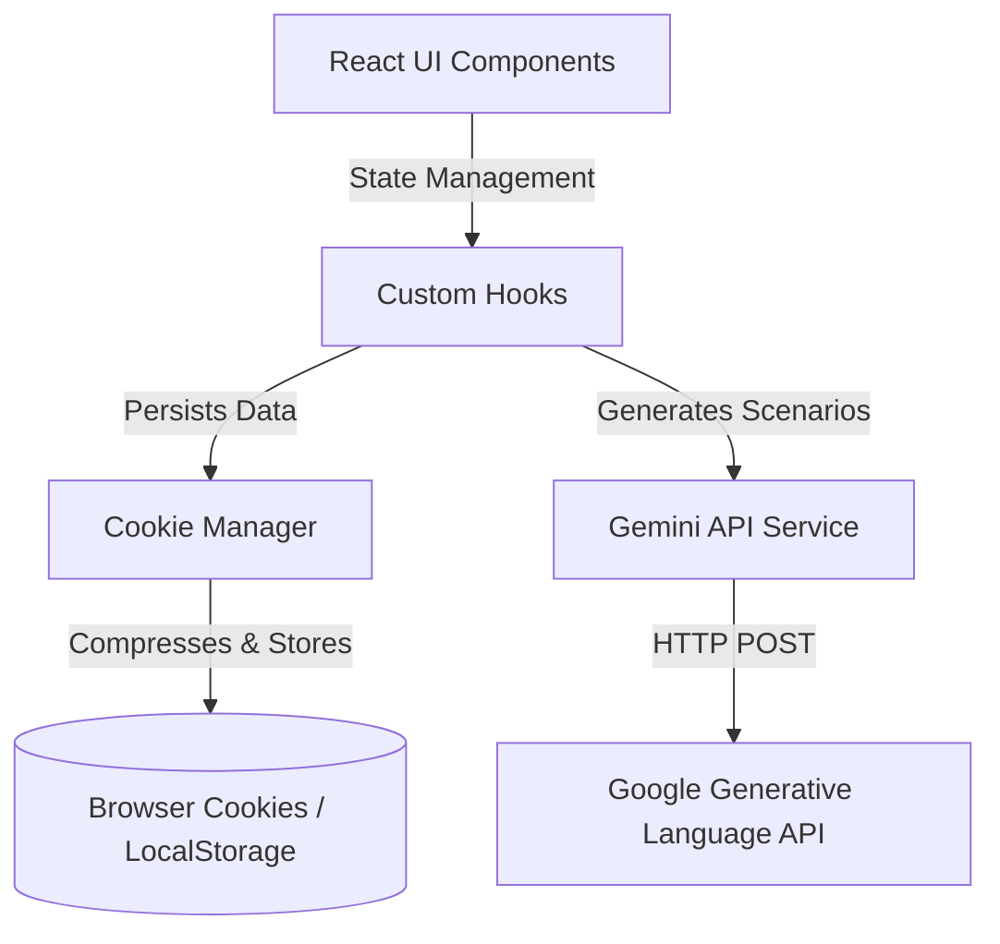
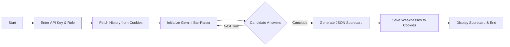
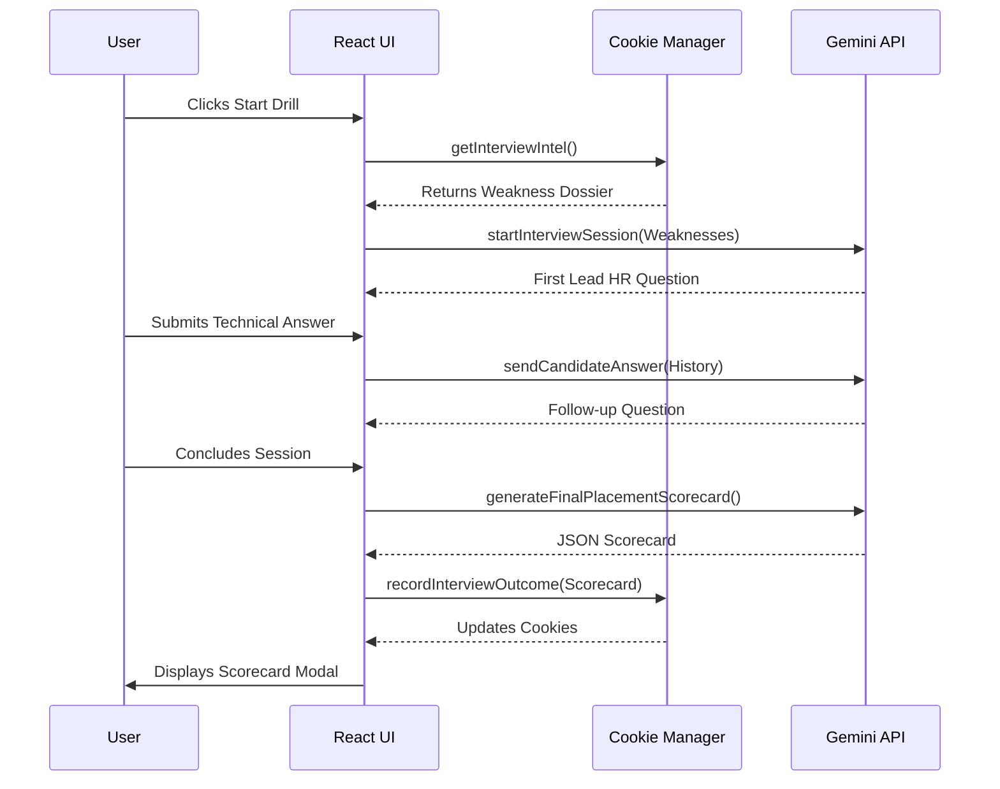

# Prepify.ai - MNC Bar-Raiser Interview Engine

Prepify is a sophisticated web application designed to simulate rigorous technical interviews, specifically modeling the strict, high-pressure environment of Tier-1 Cybersecurity MNCs.

## Features
- **Role-Specific Scenarios**: Targets SOC L1, Cloud Security Architect, Threat Hunter, etc.
- **Adaptive Weakness Probing**: Remembers your past mistakes and grills you on them in subsequent sessions.
- **Zero-DB Architecture**: 100% client-side privacy. All telemetry is stored in compressed cookies.
- **Placement Scorecards**: Rigorous evaluations with textbook corrections and radar scores.

## Technologies Used
- React 19 + Vite
- TailwindCSS v4
- Google Gemini API (AI Engine)
- Vitest (Testing)
- Lucide React (Icons)

## Installation & Running Locally
1. Clone the repository and navigate to the project directory.
2. Install dependencies:
   ```bash
   npm install
   ```
3. Start the development server:
   ```bash
   npm run dev
   ```
4. Access the app at `http://localhost:5173`. Click the Profile icon to enter your Gemini API key.

## Testing
To run the automated tests for core persistence logic:
```bash
npm install -D vitest jsdom
npm test
```

## UML & Design Diagrams

### System Architecture


### Process Workflow


### Use Case Diagram
```mermaid
usecase
    actor Candidate
    usecase "Configure Profile/Key" as UC1
    usecase "View Telemetry History" as UC2
    usecase "Take Technical Interview" as UC3
    usecase "Receive Scorecard" as UC4
    
    Candidate --> UC1
    Candidate --> UC2
    Candidate --> UC3
    UC3 --> UC4
```

### Sequence Diagram


## Screenshots
*(Optional: Ensure to attach screenshots in the root directory or embed them here)*
